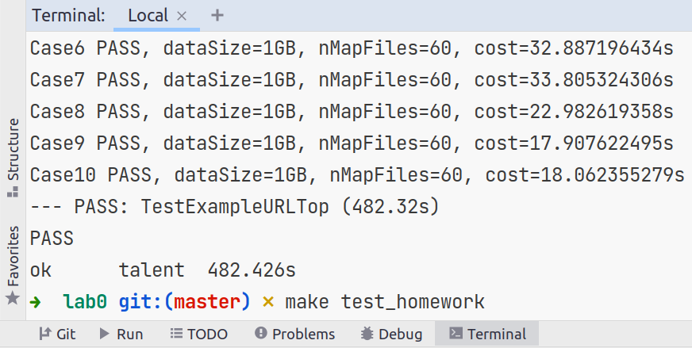
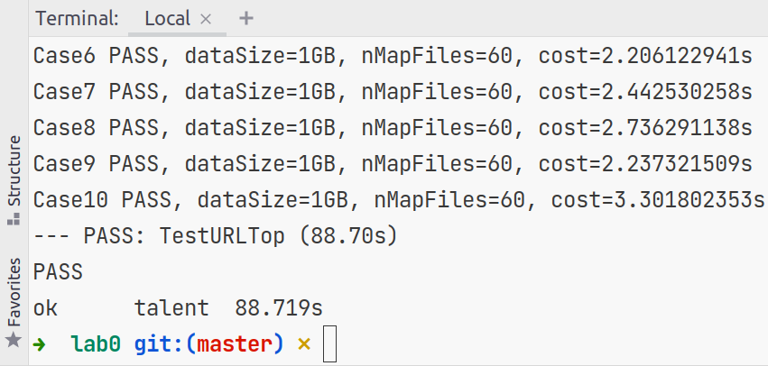

# Lab0 实验报告

## 实验结果

### 1. 完成 Map-Reduce 框架

`make test_example` 的实验截图

### 2. 基于 Map-Reduce 框架编写 Map-Reduce 函数

`make test_homework` 的实验截图

## 实验总结

在这部分可以简单谈论自己在实验过程中遇到的困难、对 Map-Reduce 计算框架的理解，字数在 1000 字以内。

对于第一题，只需要根据MapReduce的原理进行实现即可。

对于第二题，Example中的URL计数和取TopN的过程全部由第二个MapReduce任务的Reducer完成，而该Reducer的并行度为1，
这使得MapReduce并行计算的能力被极大地浪费。

为了充分利用这种能力，我尝试的第一种方案是采用一个MapReduce任务，
其中的Map阶段进行并发度为`nWorkers`的局部URL计数，经过Shuffle后由并发度为1的Reduce阶段合并Map阶段产生的局部计数，
产生全局的URL计数结果，最后取TopN。

第一种方案的问题在于若每个Mapper读取的文件Split中URL的重复率不高（如`Case4, dataSize=1GB, nMapFiles=60`），
那么大量的计算还是被推到了并发度为1的Reduce阶段。为了解决这个问题，我采取的第二种方案（提交代码中的方案）采用了两个MapReduce任务，
其中第一个MapReduce任务的Map和Reduce阶段都进行了并发度为`nWorkers`的URL计数。由于Map与Reduce之间按Key（URL）进行了Shuffle，
这种方案避免了方案一中进行URL计数的并发度仅为1的问题。随后，第二个MapReduce任务的Reduce阶段进行了TopN的求解。

方案二相比方案一的劣势在于两个MapReduce任务带来了更多的Shuffle落盘开销。但实验结果显示方案二能将方案一的总执行时间从120秒提升到88秒，
对于`Case4, dataSize=1GB, nMapFiles=60`等用例而言能减少50%的执行时间。